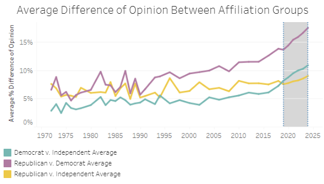

# Faultlines 
by Shawn Sobieski

An analysis of how the two party system has changed in the past fifty years, and A look to the possible future. 

## Methodology
The Faultlines project is based on data collected from the General Social Survey conducted by the University of Chicago. It spans fifty years and over 30 different survey questions. It seeks to look at the divisiveness in American partisan politics through the lens of public opinion to try to discover how people choose to identify with political parties in America, and how those choices affect the parties' identities and values over the last fifty years. 
In addition I applied ARIMA modeling techniques to project into the future, attempting to see what the landscape may be from now until 2024. 
This summary of the project will provide an overview of a few sections that stood out in the analysis and explain what it could mean for the future of partisan politics in America. 
If you are interested in seeing more, please take a look at my github repo with the full version of the project, including the data collected from the General Social Survey. 

### Where do we stand?
Before diving into some more specific examples, its a good idea to take a look at the overall picture of American politics today. Since 1972, affiliation with some form of independent party has risen from 10% to a predicted 21% by 2024, and as a result many of the attitudes that define the parties have hardened to become diametrically opposed. While affiliation with a party is still the norm, people are increasingly identifying with no political party at all.
A huge proportion of this shift has come from democratic party defectors. The exact reasons for this are not explained by the data, but as more and more people end their affiliation with the democratic party the proportions that align with republicans and independents are on the rise.
One consequence of this is that of those who remain politically affiliated are labeling that affiliation as strong than ever before.

In fact, the models I ran predict that those who identify strongly with either of the two parties are set to become the largest subgroup in the party in the near future. Based on the amount of people overall that identify strongly with either party however, this has less to do with people shifting their attitudes toward strong support, and more to do with low affiliation voters who are causing the rising tide of independents by rejecting party affiliation altogether.  
Within both parties the number of people identifying themselves as moderate members (labeled as 'central affiliation' on the graphs) has dropped significantly since 1972. Much of that can be attributed to the increase in those identifying as either leaning toward a party or completely independent. In other words, there is no evidence that people are being pulled to stronger affiliations within the party.
As the trend of citizens affiliating themselves with no political party in particular continues, partisan opinion is spreading farther and farther apart across a variety of issues. Because of this it is likely that by 2024, voters with a self-described 'strong' affiliation with their party will define the direction of the two party system. 

Differences in opinion have always defined the party system, however, as more passionate voices gain influence over the values held by each party the differences in opinion have increased drastically. 
Across the 34 survey questions the average percentage difference of opinion between Republicans and Democrats was only 7% in 1972. By 2024 that number is projected to reach 18%.
Over time not only are the parties agreeing about less, but they are becoming more steadfast in their opinions, resulting in a snowball effect as the parties increasingly define themselves along the lines of these differences in values.

